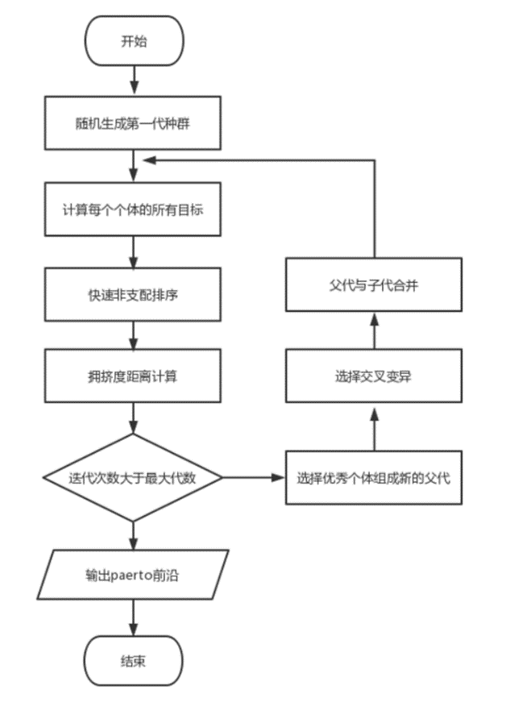
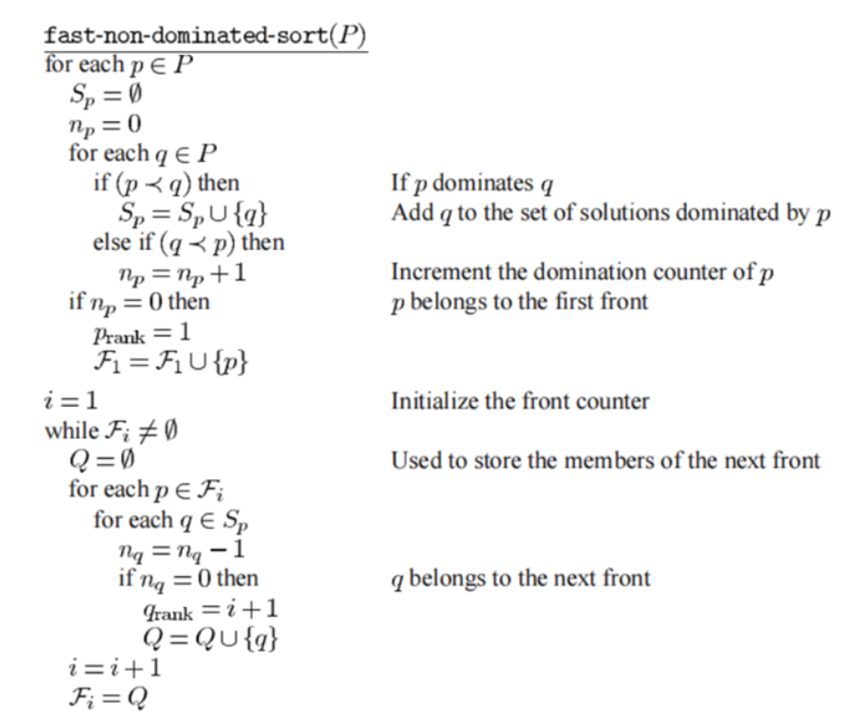
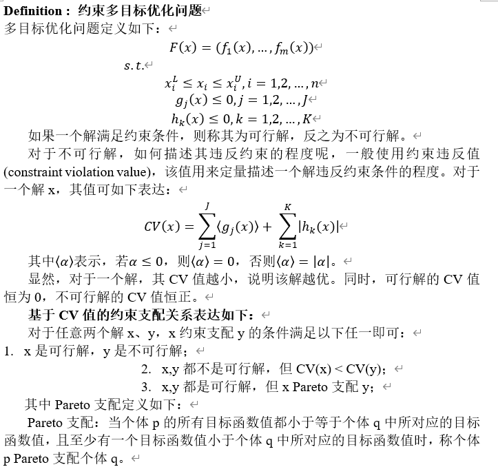
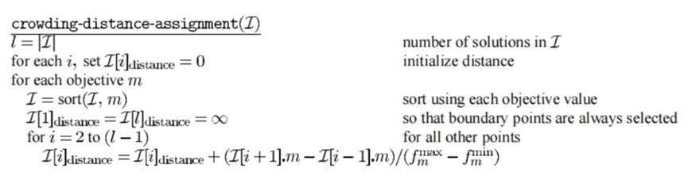
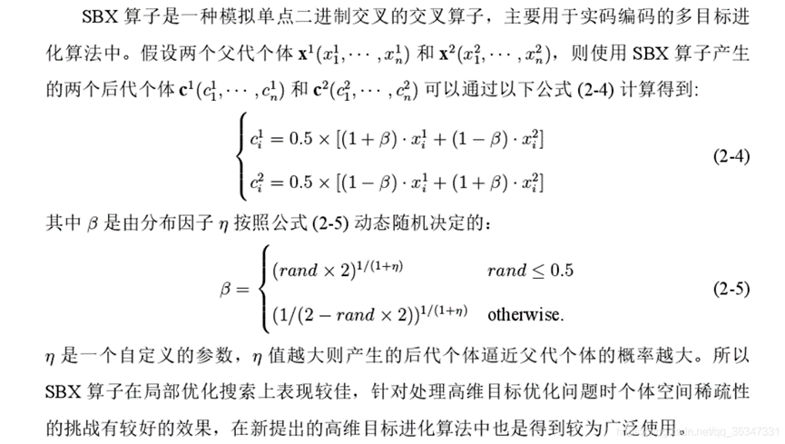
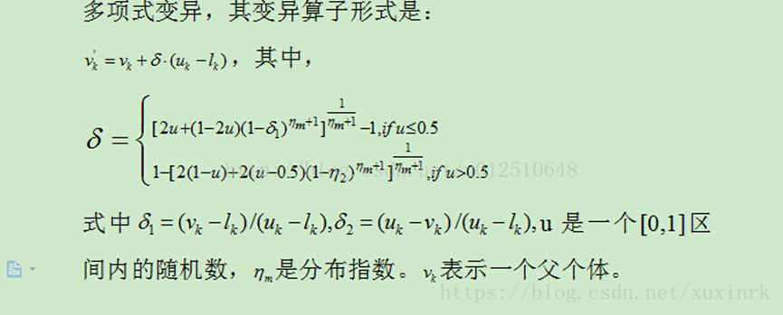

# CUG智能优化课程设计
## 使用NSGA-Ⅱ算法求解带约束的多目标优化问题，CEC-2021竞赛测试题，至少5道。
### NSGA-Ⅱ算法流程图

### 快速非支配排序

### 其中支配关系采用约束支配

### 拥挤度计算

### 编码方式采用实数编码
### 模拟二进制交叉SBX

### 多项式变异

## 其他说明
项目中，除了main.py外，每个文件都是一个函数。

main.py是运行的主函数。

HV.m和cal_hv.m是提供的matlab代码，用于计算结果的HV指标。

RefPoints文件夹下是CEC2021竞赛每道题计算HV指标所需的观察点坐标，不需要更改。

RWCMOPs.py函数中存放了5道题目，题目源自CEC-2021竞赛。

## 使用方法：

1）运行main.py，将结果保存至Result文件下

2）打开matlab，运行cal_hv.m，即可得到hv指标。

3）后续可以将2）中结果存入excel，观察找出每个题目最优hv所在轮数，然后转到plot_costs.py函数下，里面有使用方法，绘制最优解。

【注】：main.py的main函数中，注释部分即绘图代码，将注释打开即可显示每轮pareto前沿变化图。

